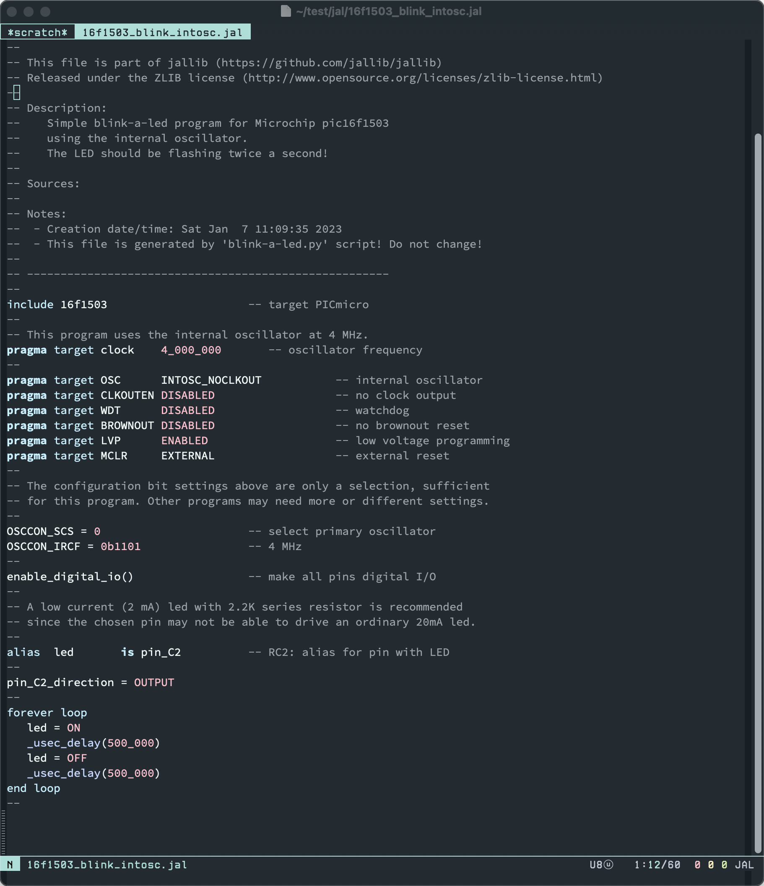

# jal-mode

**WIP**

This major mode is for editing [JAL (Just Another Language)](http://justanotherlanguage.org/).

JAL is a programming language to program Microchip PIC controllers.

This major mode will support jalv2 compiler.

## Links
- [JAL (Just Another Language)](http://justanotherlanguage.org/)
- [jallib](https://github.com/jallib/jallib)

## TODO
- [x] font-lock syntax highlighting
- [ ] indentation
- [ ] package
- [ ] compile .jal
- [ ] programming .hex into pic micro controller
- [ ] flycheck
- [ ] completing
