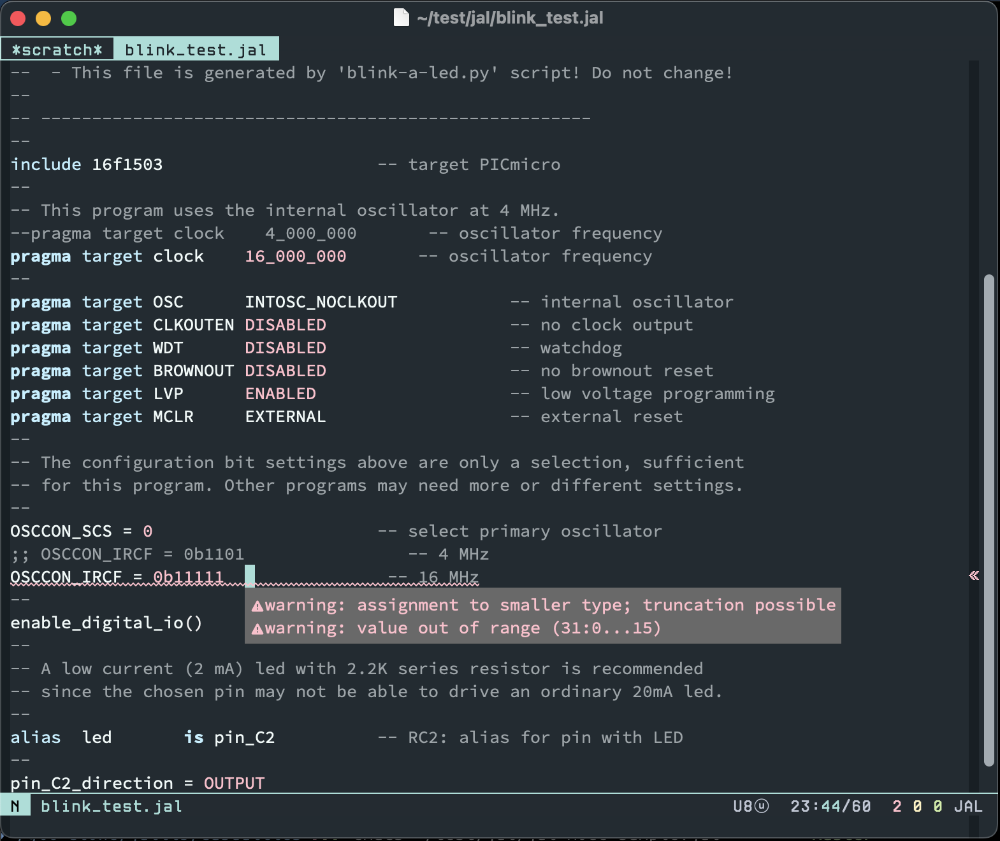

# jal-mode

Emacs major mode for editing [JAL](http://justanotherlanguage.org/) source file



**WIP**

JAL is a programming language to program Microchip PIC controllers.

This major mode supports jalv2 compiler and jallib.

## Example settings

``` emacs-lisp
(use-package jal-mode
  :config
  (setq tab-width 4)                          ;; as you like
  (setq jal-mode-compiler-path "/SOMEWHERE/jalv2-XXXX")
  (setq jal-mode-lib-path "/SOMEWHERE/jallib-XXXX/lib")

  ;; Use RP2PIC as a PIC programmer
  (setq jal-mode-prog-func #'jal-mode-prog-func--rp2pic)

  ;; Enable flymake
  (setq temporary-file-directory "~/tmp")     ;; as you like
  (add-hook 'jal-mode-hook #'flymake-mode)

  ;; or Enable flycheck
  ;; (use-package flycheck-jal
  ;;   :config
  ;;   (add-hook 'jal-mode-hook #'flycheck-mode))
)
```

## Default keybindings
|Function|Key|Function name|
|:--|:--|:--|
|Compile|`C-c` `C-c`|`jal-mode-compile`|
|Next error|`C-c` `C-n`|`flymake-goto-next-error`|
|Previous error|`C-c` `C-p`|`flymake-goto-prev-error`|

## TODO
- [x] syntax highlighting (font-lock)
  - [ ] inline asm 
- [x] compile .jal
- [x] flymake
  - [ ] warning
- [x] flycheck
  - [ ] warning
- [ ] case insensitive
- [ ] programming .hex into pic micro controller
  - [x] RP2PIC programmer
  - [ ] other programmers
- [ ] package
- [ ] auto indentation (smie?)
- [ ] completion

## Links
- [JAL (Just Another Language)](http://justanotherlanguage.org/)
- [jallib](https://github.com/jallib/jallib)
- [jallist (JAL Group)](https://groups.google.com/g/jallist)
- [RP2PIC Programmer](https://github.com/hidsh/rp2pic)
